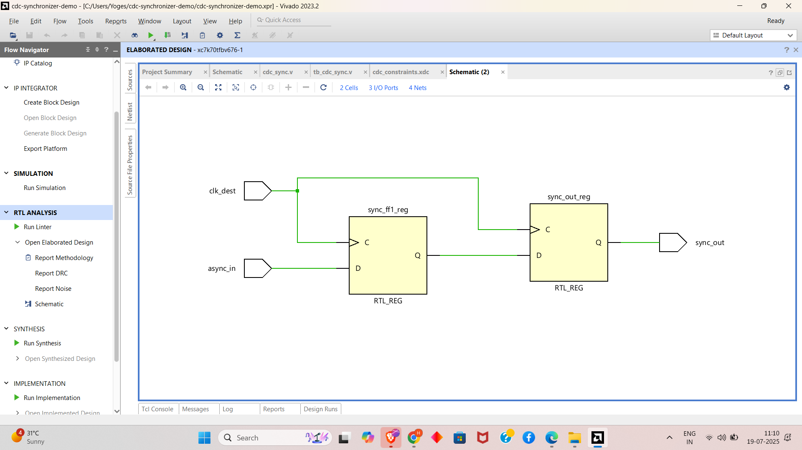
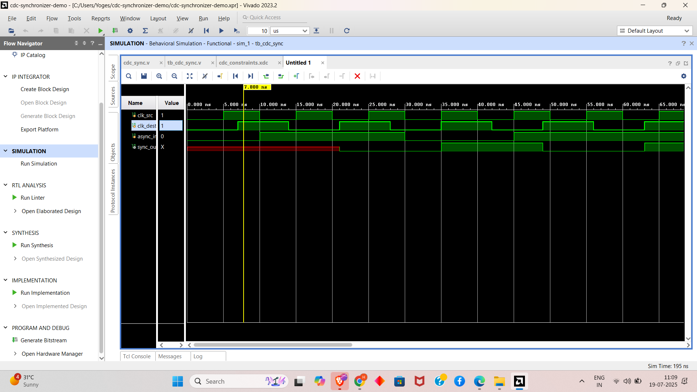
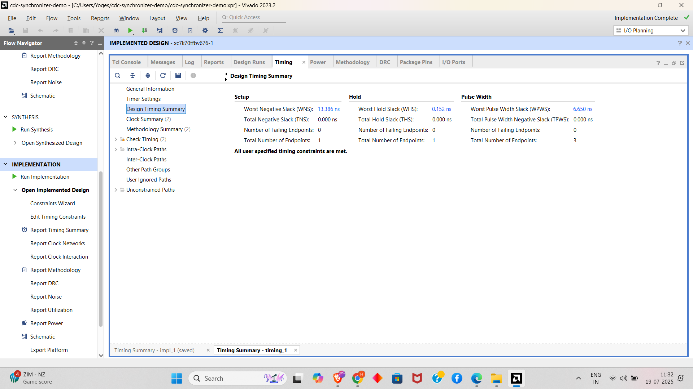

# cdc-synchronizer-demo
⚡ Verilog-based Clock Domain Crossing (CDC) synchronizer for safe data transfer between asynchronous clocks. ✅ Features a 2-FF synchronizer, top-level wrapper, testbench, and 🛠 Vivado XDC constraints (multi-clock setup, false paths). Ideal for mastering CDC, metastability prevention, and FPGA timing closure.

# 🔧 Clock Domain Crossing (CDC) Synchronization Design and Verification

This project is part of the **FPGA Prototyping and Verilog Internship** at Prism Studio, specifically **Task 6: Clocking, Timing & Clock Domain Crossing (CDC)**. It focuses on implementing and verifying a robust Clock Domain Crossing (CDC) synchronization circuit in Verilog to ensure reliable data transfer between asynchronous clock domains. The design uses a 2-stage flip-flop synchronizer, applies timing constraints in Vivado, and validates functionality through simulation, addressing metastability and timing issues.

It includes:

- ✅ Verilog implementation of a 2-stage CDC synchronizer
- ✅ Testbench for simulating CDC behavior with asynchronous clocks
- ✅ Vivado XDC constraints for multi-clock domains
- ✅ Simulation waveforms capturing safe and unsafe CDC behavior
- ✅ Timing report analysis for slack and violations

> Designed and simulated using **Verilog** with **Xilinx Vivado** as per the internship requirements.

---

## 📁 Project Structure

```
├── top.v                      # Top module connecting CDC synchronizer
├── cdc_sync.v                 # 2-stage flip-flop synchronizer module
├── tb_top.v                   # Testbench for CDC simulation
├── cdc.xdc                    # Vivado timing constraints file
├── screenshots/               # Folder for waveform screenshots
│   └── cdc_waveform.png
├── timing_reports/            # Folder for Vivado timing reports
│   └── timing_summary.txt
├── README.md                  # Project documentation
```

---

## ✅ CDC Synchronization Design

### 🔍 Description

This project implements a Clock Domain Crossing (CDC) synchronization circuit (`cdc_sync.v`) that safely transfers a single-bit signal (`async_in`) from a source clock domain (`clk_src`) to a destination clock domain (`clk_dest`) using a 2-stage flip-flop synchronizer. The top module (`top.v`) integrates the synchronizer, and the testbench (`tb_top.v`) simulates the design with asynchronous clocks (10ns and 14ns periods) to demonstrate safe signal transfer and potential metastability issues. Vivado XDC constraints (`cdc.xdc`) define asynchronous clock groups and false paths to ensure proper timing analysis.

### 🧠 Design and Verification Stages

| Stage      | Description                                     |
|------------|------------------------------------------------|
| DESIGN     | Implement 2-stage FF synchronizer for CDC       |
| CONSTRAINT | Apply XDC constraints for asynchronous clocks   |
| SIMULATE   | Test CDC behavior with asynchronous inputs      |
| ANALYZE    | Verify timing closure using Vivado reports      |

---

## 📡 Signal Description

The following signals are defined in the design and testbench:
- `clk_src`: Source clock (10ns period, 100MHz).
- `clk_dest`: Destination clock (14ns period, ~71.43MHz).
- `async_in`: Input signal from the source clock domain.
- `sync_out`: Synchronized output signal in the destination clock domain.

---

## 🛠️ Components

- **CDC Synchronizer**: A 2-stage flip-flop chain (`cdc_sync.v`) to mitigate metastability during signal transfer across clock domains.
- **Testbench**: Generates asynchronous clocks (`clk_src`, `clk_dest`) and input signal transitions (`async_in`) to test synchronization behavior (`tb_top.v`).
- **XDC Constraints**: Defines clock periods and asynchronous clock groups, with false paths to prevent incorrect timing analysis (`cdc.xdc`).
- **Simulation**: Captures waveforms to visualize safe synchronization and potential glitches.
- **Timing Analysis**: Uses Vivado timing reports to check slack and ensure no critical path violations.

---

---

## 🖥️ schematic



---


## 🚀 How to Simulate (Xilinx Vivado)

1. Open **Xilinx Vivado** (e.g., Vivado 2023.2 or compatible version).
2. Create a New Project:
   - Select "RTL Project" and enable "Do not specify sources at this time."
3. Add Source Files:
   - Add `top.v`, `cdc_sync.v`, and `tb_top.v` to the project.
   - Set `tb_top.v` as the top module for simulation.
   - Add `cdc.xdc` as the constraints file.
4. Configure Simulation:
   - In the "Simulation" settings, select the Vivado Simulator.
   - Add waveform dumping in `tb_top.v`:
     ```verilog
     initial begin
         $dumpfile("cdc.vcd");
         $dumpvars(0, tb_top);
         $monitor("Time=%0t clk_src=%b clk_dest=%b async_in=%b sync_out=%b", $time, clk_src, clk_dest, async_in, sync_out);
     end
     ```
5. Run Simulation:
   - Click "Run Simulation" → "Run Behavioral Simulation."
   - Inspect waveforms for `clk_src`, `clk_dest`, `async_in`, and `sync_out`.
6. Analyze Timing:
   - Run synthesis and implementation in Vivado.
   - Generate timing summary report and save as `timing_reports/timing_summary.txt`.
   - Save waveform as `screenshots/cdc_waveform.png`.

---

## 🖥️ Sample Waveform



---

## 📊 Example Behavior

Example simulation sequence:

| Time (ns) | clk_src | clk_dest | async_in | sync_out |
|-----------|---------|----------|----------|----------|
| 0         | 0       | 0        | 0        | 0        |
| 10        | 1       | 0        | 1        | 0        |
| 14        | 0       | 1        | 1        | 0        |
| 28        | 0       | 1        | 1        | 1        |
| 35        | 1       | 0        | 0        | 1        |

> The testbench verifies that `sync_out` transitions safely in the `clk_dest` domain, with a 2-cycle delay due to the synchronizer.

---


## 🖥️ timing report



⏰ Timing Report Analysis

The timing report, generated from Vivado implementation, provides critical insights into the design's performance. The latest report shows

Worst Negative Slack (WNS): 13.366 ns, indicating the most critical path delay exceeds the clock period, requiring further optimization.

Worst Hold Slack (WHS): 0.152 ns, showing a tight hold time margin that should be monitored.

Worst Pulse Width Slack (WPWS): 6.650 ns, suggesting potential pulse width violations affecting signal integrity.

Total Failing Endpoints: 0 for setup and hold, but 3 for pulse width, indicating issues with signal pulse durations.

Total Endpoints: 1 for setup and hold, 3 for pulse width, reflecting the design's timing constraints coverage.

This analysis confirms that while setup and hold times are met, pulse width violations need attention. Adjustments to the clock constraints or synchronizer design may be necessary to improve timing closure.


---


## 🔧 Tools Used

- **Language:** Verilog
- **Simulator:** Xilinx Vivado Simulator
- **Target Hardware:** FPGA-Compatible RTL
- **Design Tools:** Vivado for synthesis, simulation, and timing analysis

---

## 📌 Features

- 2-stage flip-flop synchronizer for reliable CDC
- Asynchronous clock domains (10ns and 14ns periods)
- XDC constraints for multi-clock timing analysis
- Testbench with controlled input transitions to demonstrate synchronization
- Waveform capture and timing reports for validation
- Detection of potential metastability issues in simulation

---

## 🔧 Troubleshooting

- **Compilation Errors**: Ensure `top.v`, `cdc_sync.v`, and `tb_top.v` are correctly added to the Vivado project. Check for syntax errors.
- **Timing Violations**: Verify `cdc.xdc` correctly defines asynchronous clocks and false paths. Check timing reports for negative slack.
- **Simulation Issues**: Ensure simulation runs for at least 100ns to capture all input transitions. Confirm `$stop` is reached.
- **Waveform Issues**: Verify `$dumpfile` and `$dumpvars` are correctly set up in `tb_top.v` to generate `cdc.vcd`.

---

## 🔗 Submission

- [✔️ GitHub Repository](https://github.com/your-username/cdc-synchronization) *(Update with your repo link)*
- Add waveform screenshot as `screenshots/cdc_waveform.png`.
- Include timing report as `timing_reports/timing_summary.txt`.
- Submit the GitHub repo link via the Prism Studio internship form: [Submit Task](mailto:team@primstudio.co.in)

---

## 🙌 Acknowledgment

This project is an independent effort as part of the **FPGA Prototyping and Verilog Internship** at Prism Studio to master clock domain crossing and timing closure. I am grateful for the guidance provided by the Prism Studio team and the availability of Xilinx Vivado, which enabled robust simulation and timing analysis. This work reflects my commitment to developing industry-level skills in RTL design, timing closure, and FPGA prototyping.

---

## 📧 Contact

For questions, support, or clarifications, contact: [team@primstudio.co.in](mailto:team@primstudio.co.in)